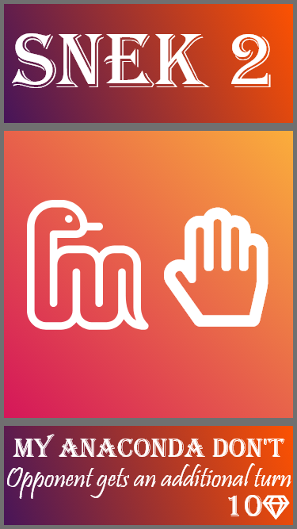
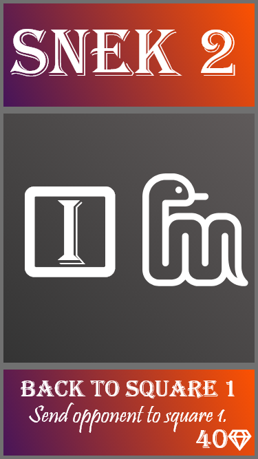

  

*A card based approach to Snakes and Ladders.*

# TL;DR (Rules)
The game is played just like the classic Snakes and Ladders game, with one major exception - there are **cards** at play!
We will assume that players know the rules to Snakes and Ladders. If not, [this link](https://www.wikihow.com/Play-Snakes-and-Ladders) explains the rules.

## Cards
One deck consists of:
<ul>
  <li>3x 10 mana cards</li>
  <li>2x 20 mana cards</li>
  <li>2x 30 mana cards</li>
  <li>1x 40 mana card</li>
</ul>
Every player takes a card from the deck at the start of their turn. They can use the card instantly or some other turn. When a card is used, it is discarded.
## Mana
Notice the gem with a number in the bottom right corner of the cards. This indicates how much mana the card uses up. Both players start the game with **0 mana**. At the **start of a turn**, the player gets **2 mana**, and **10 when they get to a snake square**. Players should keep note of this by writing the mana down on a piece of paper.

## List of cards:

Snake icon made by [freepik](https://www.flaticon.com/authors/freepik) from www.flaticon.com 
