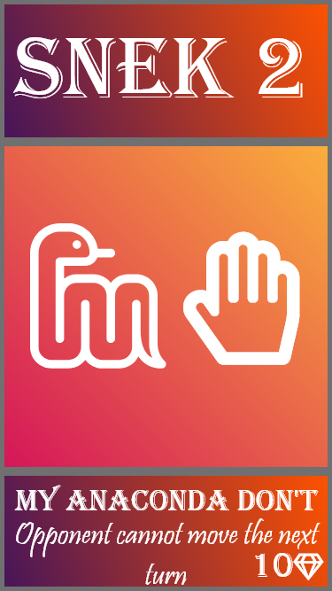
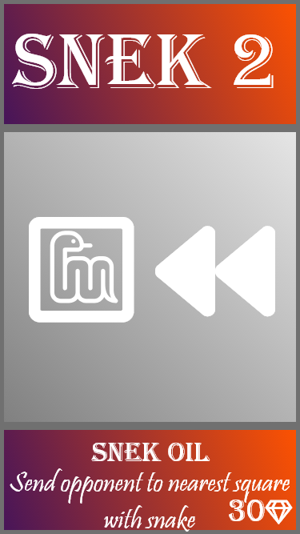

  

*A card based approach to Snakes and Ladders.*

# TL;DR (Rules)
The game is played just like the classic Snakes and Ladders game, with one major exception - there are **cards** at play!
We will assume that you know the rules to Snakes and Ladders. If you don't, [this link](https://www.wikihow.com/Play-Snakes-and-Ladders) explains the rules.

## Cards
One set consists of:

-3x 10 mana cards

-2x 30 mana cards

-1x 40 mana card

Every player gets a card at the start of their turn. It is up to them when they are going to use them. When a card is used, it is discarted.
## Mana
Notice the gem with a number in the bottom right corner of the cards. This indicates how much mana the card uses up. Both players start the game with 0 mana. Mana gets replenished by **10 when you get to a snake square**.

## List of cards:

Snake icon made by [freepik](https://www.flaticon.com/authors/freepik) from www.flaticon.com 
